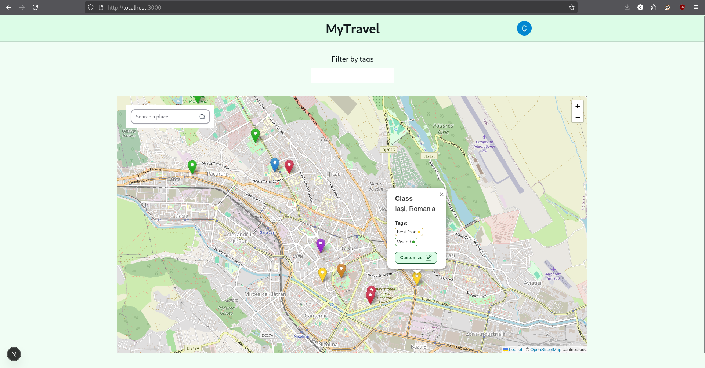
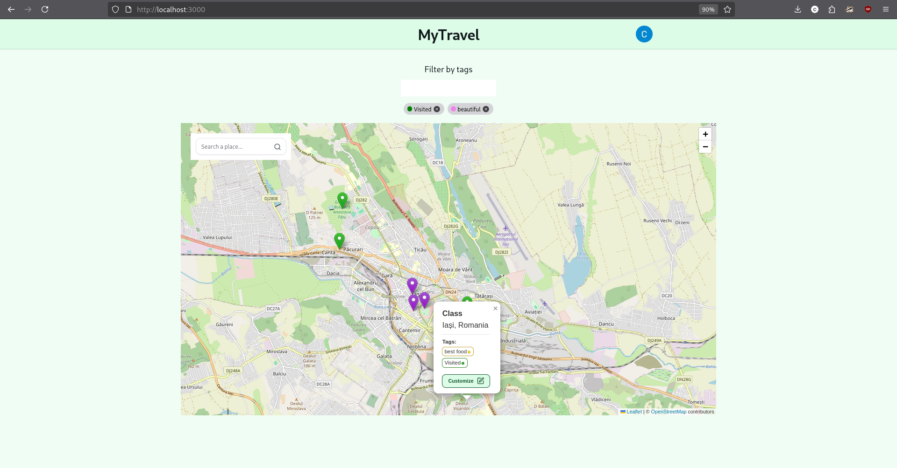

# 🌍 MyTravel

> A full-stack travel tracking app with authentication where users pin locations on an interactive map, organize them with custom tags, and keep a visual journal of places they've been.




## Live Demo
Try the app yourself: https://mytravel-one.vercel.app/


## Features & Usage

- **Interactive Map** — Search any place and pin it on a Leaflet map
- **Google OAuth** — Secure sign-in through Google, powered by NextAuth.js
- **Custom Tags** — Create colorful tags with what name you want (e.g. _Visited_, _Summer 2026_, _Favorites_) and assign them to pins
- **Tag Filtering** — Filter the map view by one or multiple tags to focus on what you need
- **Colored Pins** — Each pin reflects its first tag color for quick visual scanning (the order is adjustable)
- **Profile Dashboard** — View locations with the _Visited_ tag on your profile organized hierarchically by country → city → place
- **Location Search** — Find locations by name with Nominatim (OpenStreetMap) geocoding API

## Tech Stack

| Layer          | Technology                                  |
| -------------- | ------------------------------------------- |
| Framework      | Next.js 15 (App Router)                     |
| Auth           | NextAuth.js (Google OAuth, JWT)             |
| UI             | React 19, Tailwind CSS, HeroUI, Headless UI |
| Maps           | Leaflet + React-Leaflet                     |
| Database       | MongoDB + Mongoose                          |
| Data Mutations | Next.js Server Actions                      |

## Implementation Details

- **Server Components & Server Actions** — data fetching and mutations happen on the server with zero client-side API boilerplate
- **Optimistic UI** — most CRUD actions update the UI instantly and roll back on failure
- **`useTransition`** — search and data operations run as non-blocking transitions for a smooth UX
- **Mongoose ODM** — structured schemas with referential integrity (`User → Markup → Location/Tag`)

## Running the app

### Prerequisites

- Node.js 18+
- A MongoDB instance (local or [Atlas](https://www.mongodb.com/atlas))
- Google OAuth credentials ([console.cloud.google.com](https://console.cloud.google.com/))
- RapidAPI key for OpenStreetMap Geocoding API (rapidapi.com)

### Setup

````bash
# Clone the repo

# Install dependencies
npm install

# Create a .env.local file
```env
MONGODB_URI=mongodb+srv://<user>:<password>@cluster.mongodb.net/mytravel
GOOGLE_CLIENT_ID=your-google-client-id
GOOGLE_CLIENT_SECRET=your-google-client-secret
NEXTAUTH_SECRET=any-random-string
NEXTAUTH_URL=http://localhost:3000
RAPIDAPI_KEY=your-rapidapi-key
````

```bash
# Run the dev server
npm run dev
```

Open [http://localhost:3000](http://localhost:3000) and sign in with Google.

## Screenshots
| Filter | Profile | 
|:---:|:---:|
|  |  |


